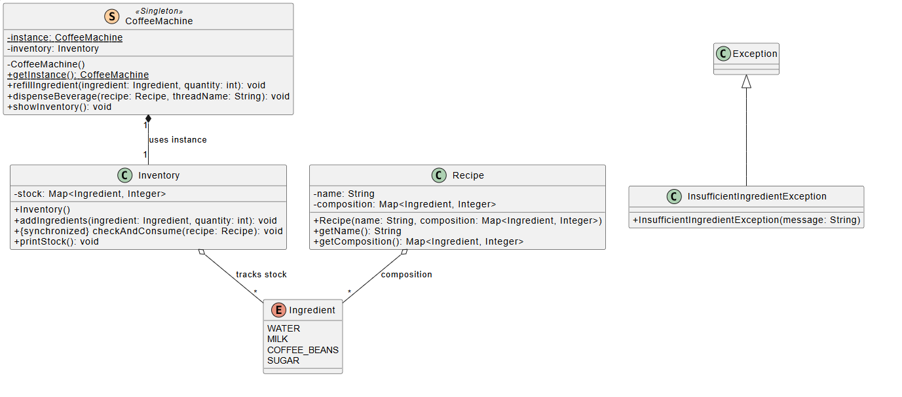

# Coffee Machine - Low Level Design (Java)

A production-grade, thread-safe implementation of a Coffee Machine system. This project demonstrates core Object-Oriented Programming (OOP) principles, the Facade design pattern, and robust concurrency management in Java.

## 📌 Core Features
* **Menu Management:** Supports multiple beverages (Espresso, Latte, etc.) with unique recipes and pricing.
* **Inventory Tracking:** Real-time monitoring of ingredients (Milk, Water, Coffee Beans, Sugar).
* **Thread Safety:** Handled via synchronized blocks and the Java Memory Model to prevent race conditions during concurrent orders.
* **Singleton Pattern:** Ensures a single point of control for the machine hardware.

---


## 📋 1. Requirements Specification

### Functional Requirements
- **Menu:** The machine serves different beverages (e.g., Espresso, Cappuccino, Latte).
- **Recipes:** Each beverage requires a specific composition of ingredients (Water, Milk, Coffee Beans, Sugar).
- **Inventory:** The machine tracks the exact quantity of available ingredients.
- **Dispensing:** The machine checks if ingredients are available, deducts them, and serves the drink.
- **Refilling:** An admin can restock the ingredients.

### Non-Functional Requirements
- **Thread Safety:** Must handle concurrent beverage orders without state corruption (preventing negative inventory).
- **Scalability:** New beverages can be added by simply defining a new Recipe/Beverage object (Open-Closed Principle).
- **Reliability:** Uses custom exceptions for clear error reporting during failures.

---

## 🏗️ Class Diagram
Below is the architectural overview of the system components and their relationships.



---

## 📂 Project Structure
The solution is organized into logical packages to ensure high maintainability and follow the Single Responsibility Principle (SRP).

```
src
└── com
    └── lld
        └── coffeemachine
            ├── Main.java               # Entry point & Concurrency Simulation
            ├── core
            │   ├── CoffeeMachine.java  # Controller (Singleton & Facade)
            │   └── Inventory.java      # Thread-safe Resource Management
            ├── models
            │   ├── Beverage.java       # Menu Item Entity
            │   ├── Ingredient.java     # Raw Material Enum
            │   └── Recipe.java         # Ingredient Composition Blueprint
            └── exceptions
            └── InsufficientIngredientException.java # Custom Business Exception
```
---

## ☕ Key Design Discussions

### 1. Thread Safety & Atomicity
In a multi-user environment, two people might order the last cup of milk at the same time. This implementation uses a "Check-and-Deduct" atomic routine:
* **Synchronized Blocks:** The checkAndConsume method in the Inventory class is synchronized. This prevents a race condition where two threads see available stock, but the second thread finds it empty by the time it tries to deduct.
* **Memory Visibility:** The displayInventory method is also synchronized. This creates a happens-before relationship, ensuring that the status report reflects the most recent, consistent state of the machine.

### 2. The Singleton Pattern
The CoffeeMachine uses Double-Checked Locking with the volatile keyword. This ensures that only one instance of the machine exists across the application while maintaining high performance.

### 3. Separation of Concerns
* **Recipe vs. Beverage:** A Recipe holds the "math" (quantities), while a Beverage holds the "market data" (name and price). This allows us to have different products (e.g., "Discount Espresso") using the same recipe without duplicating logic.

---

## 🚀 How to Run
1. Clone the Repository.
2. Open in your favorite IDE (IntelliJ IDEA, Eclipse, or VS Code).
3. Run Main.java.
    * The simulation will initialize the inventory.
    * It will trigger multiple concurrent threads simulating simultaneous users.
    * Observe the console logs to see how the machine handles "Insufficient Ingredient" errors gracefully.

---

## 🛠️ Tech Stack
* Language: Java 11+
* Concurrency: Java Threads, synchronized, ConcurrentHashMap, EnumMap.
* Documentation: Javadoc for critical concurrency methods.