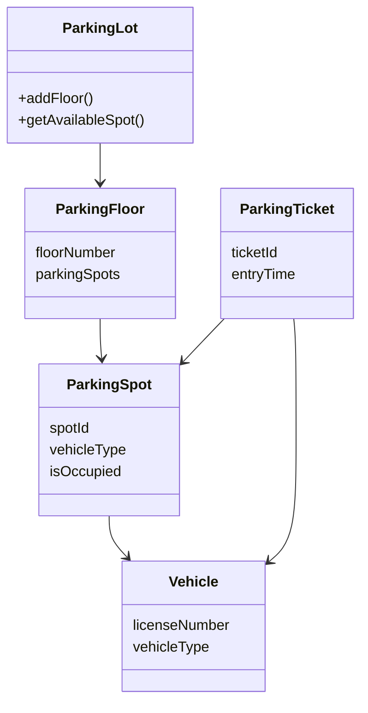
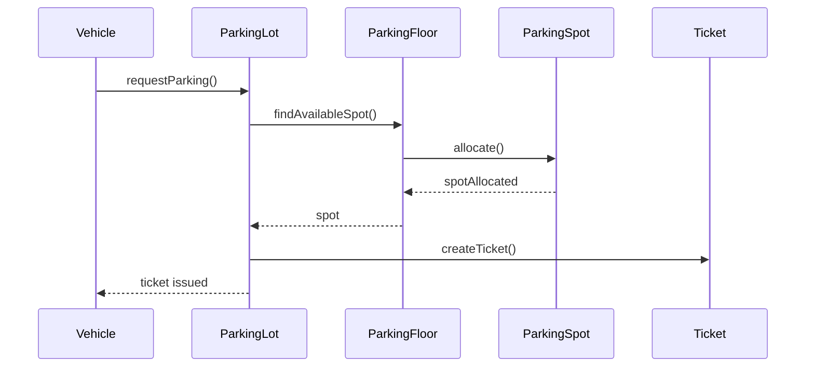

# Parking Lot - Low Level Design (Java)

This module contains the **Low Level Design (LLD) implementation of a Parking Lot system in Java**.

The goal of this project is to demonstrate how to approach real-world system design problems using **object‑oriented design principles** and a structured thinking process.

This design is explained in detail in the corresponding lecture from the **Code & Code LLD Masterclass**.

## 🎥 Lecture

Parking Lot LLD Video  
https://www.youtube.com/watch?v=wIo7igW3sW4

LLD Playlist  
https://www.youtube.com/playlist?list=PL5DyztRVgtRXc38XDgmL34o1pp7U__hDK

---

# Approach Used: CERID

To design the system, we follow the **CERID approach**.

C → Clarify Requirements  
E → Define Entities  
R → Relationships between Entities  
I → Interaction between Entities  
D → Durability / Future Proof Design

This is the same structured approach typically used in **LLD interviews and machine coding rounds**.

---

# 1. Clarify Requirements

Before writing code, we clarify the system requirements.

### Functional Requirements

The parking lot system should:

- Allow vehicles to enter the parking lot
- Allocate an available parking spot
- Issue a parking ticket
- Allow vehicles to exit
- Calculate parking charges
- Free the parking spot after exit

### Non Functional Requirements

- System should support multiple vehicle types
- Parking allocation should be efficient
- System should be extendable
- Thread safe (multiple entry gates)

---

# 2. Define Entities

### ParkingLot
Represents the entire parking facility.

Responsibilities:
- Maintain parking floors
- Track available spots
- Allocate parking

### ParkingFloor
Represents a floor in the parking lot.

Responsibilities:
- Maintain multiple parking spots
- Track availability per floor

### ParkingSpot
Represents a single parking spot.

Attributes:
- spotId
- vehicleType
- isOccupied

Responsibilities:
- Park vehicle
- Remove vehicle

### Vehicle
Represents a vehicle entering the parking lot.

Attributes:
- licenseNumber
- vehicleType

Vehicle types may include:
- CAR
- BIKE
- TRUCK

### ParkingTicket
Issued when a vehicle enters the parking lot.

Attributes:
- ticketId
- vehicle
- parkingSpot
- entryTime

Responsibilities:
- Track entry time
- Used for billing at exit

### ParkingLotManager / Service
Handles the **core business logic**.

Responsibilities:
- Allocate parking
- Issue tickets
- Release spots
- Calculate charges

---

# 3. Relationship Between Entities

ParkingLot  
└── ParkingFloor  
└── ParkingSpot  
└── Vehicle

ParkingTicket references:
- Vehicle
- ParkingSpot

---

# UML Class Diagram



GitHub automatically renders this **Mermaid UML diagram**.

---

# 4. Interaction Between Entities

## Vehicle Entry Flow

Vehicle arrives  
↓  
System checks available spots  
↓  
Parking spot allocated  
↓  
Parking ticket issued  
↓  
Vehicle parked

### Sequence Diagram



---

# Vehicle Exit Flow

Vehicle arrives at exit  
↓  
Ticket scanned  
↓  
Parking charge calculated  
↓  
Payment completed  
↓  
Parking spot released

---

# 5. Durability (Future Proof Design)

Possible improvements:

### Multiple Entry / Exit Gates
Add:
- EntryGate
- ExitGate

### Payment System
Introduce strategies:
- CashPayment
- CardPayment
- UPIPayment

### Dynamic Pricing
Introduce:
- PricingStrategy

Examples:
- HourlyPricing
- WeekendPricing
- DynamicPricing

### Parking Strategy
Examples:
- NearestSpotStrategy
- LowestFloorStrategy
- RandomSpotStrategy

---

# Thread Safety Considerations

In real systems multiple vehicles may enter simultaneously.

Possible problems:
- Two vehicles allocated the same spot
- Race conditions

Possible solutions:
- synchronized blocks
- ReentrantLock
- Atomic counters
- Concurrent collections

Example:

```java
synchronized allocateSpot() {
   if(spotAvailable)
       assignSpot();
}
```

---

# Key Design Principles Used

Encapsulation – each class manages its own responsibility.

Separation of Concerns – parking allocation, ticketing, and pricing are separated.

Extensibility – easy to add new vehicle types or pricing strategies.

Maintainability – modular design improves readability and scalability.

---

# Learning Outcomes

By studying this design students will learn:

- How to approach **LLD interview problems**
- How to convert **real world systems into Java classes**
- How to design **extensible systems**
- How to reason about **thread safety**

---

# Author

**Code & Code**

YouTube Channel  
https://www.youtube.com/@codencode

LLD Playlist  
https://www.youtube.com/playlist?list=PL5DyztRVgtRXc38XDgmL34o1pp7U__hDK
